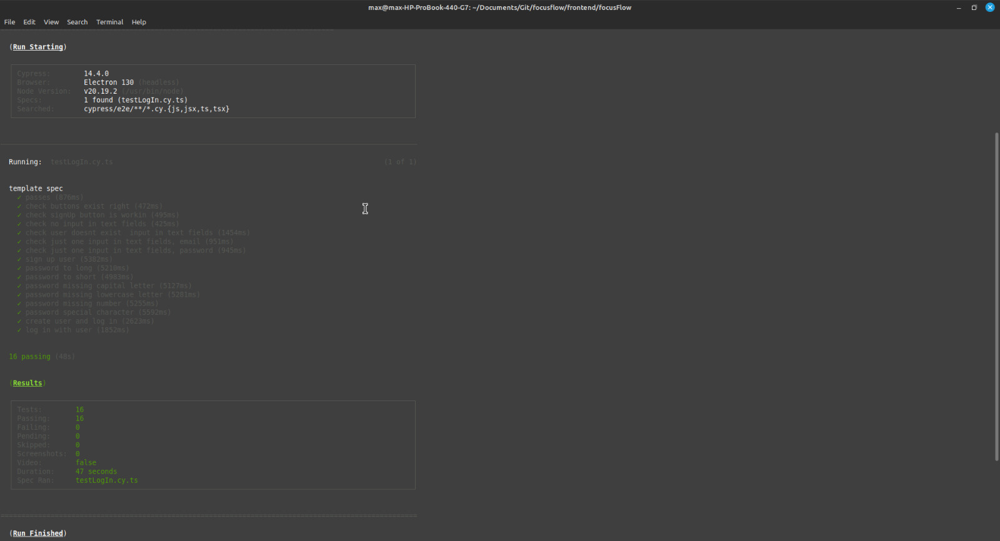
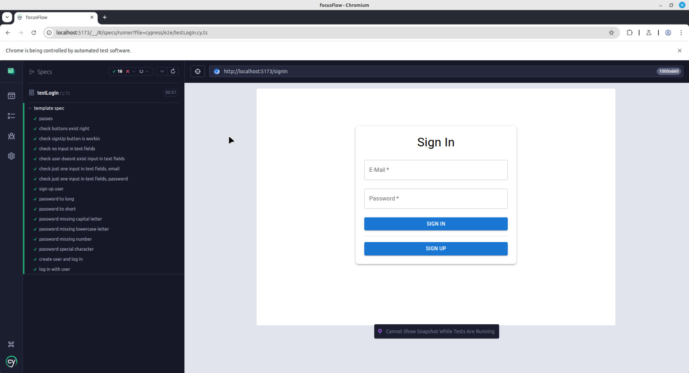

# Exercise 10

## Exercise 10.1 (15 Points): Implement UI for FocusFlow

To start the full app with the Frontend you may use Docker Compose.
Please ensure that the you updated the Backend DB Connection as detailed [here](https://github.com/MaxTrautwein/focusflow/tree/main/backend/focusflow#2-update-applicationproperties])

Go to the Root and start with `docker compose up`

## Exercise 10.2 (10 Points): Automate UI or E2E Tests

To install Cypress, navigate to the frontend/focusflow directory and use the command:
"npm install cypress --save-dev".

In the package.json, remove the line type: "module", as it causes errors.

Append the dependencies to the tsconfig.json, or create a separate tsconfig.cypress.ts and refer to it.
Dependencies:
{
"compilerOptions": {
"target": "ES2020",
"module": "ESNext",
"moduleResolution": "Node",
"types": ["cypress"],
"esModuleInterop": true,
"strict": true
},
"include": ["cypress.config.ts", "cypress"]
}

In the cypress directory, which appears after you install Cypress in your project, navigate to cypress/e2e and create a new file, e.g., testName.js.

Copy the following into the file:
describe('template spec', () => {

        it('passes', () => {
            cy.visit('http://localhost:yourPort/')
        })
    }

Then replace yourPort with the actual port number of your frontend application. This will open your website.

Now you are ready to write tests.

To execute existing tests, start the frontend and backend of your application.
Navigate in the CLI to the frontend directory where Cypress is located (frontend/focusflow) and execute:

    npx cypress open – to run tests with the GUI.
    npx cypress run – to run tests in the CLI without the GUI.

## Exercise 10.3 (10 Points): Execute & Document your tests

#### Headles Mode

#### Interactive Mode

Summary:

As soon as cypress was integrated into the project, it was easy to create the individual test cases for the logIn and signUp functionalities.
The cypress test language is very intuitive amd easy to use.
However, if you plan to use cypress to test your application, this should be communicated with the frontend developer early in the developing phase.
To prevent cypress errors during testing, its important to assign a unique identifier to each testable element.  
This can be done using attributes like data-cy="nameForTheElement".

## (optional) Exercise 10.4 (10 Points): Integrate Tests into CI Pipeline
