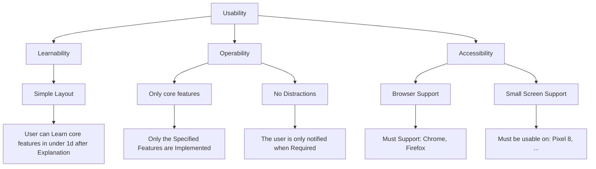
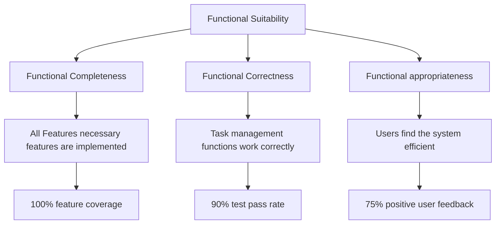
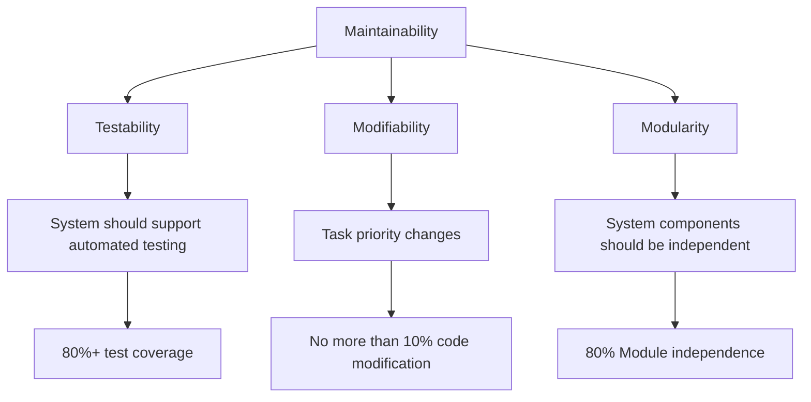
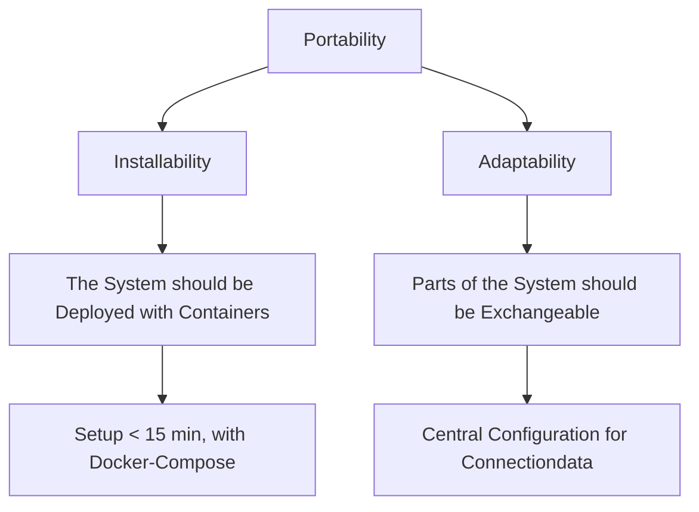

# Exercise 2 - FocusFlow Requirements and Use Cases

## Exercise 2.1 (10 Points): Requirements (Functional System Requirements)

Should reflect key functionalities that FocusFlow must offer its users.

### 1. Task Management

- Users must be able to create, edit and delete tasks
- Each task must have the following features:
  - Title
  - Description
  - Due Date
  - Priority Level
- Users should be able to edit existing tasks (to update status or modify details)

### 2. Task Status Management

- Possible status for tasks:
  - "Open"
  - "In Progress"
  - "Done"
  - "Overdue" (The date of the task has passed)
- The system must automatically change a task's status to "Overdue" if the due date has passed and the task is not marked as "Done"

### 3. Task Organization

- Tasks should be grouped into categories or projects to help users structure their workload
- Users should be able to view and manage tasks within these categories

### 4. User Allocation & Collaboration

- Users can assign tasks to themselves or other team members
- Users should have the option to assign tasks to multiple team members if needed
- The system should notify assigned users automatically when they receive a new task
  - The system should notify assigned users via email or in-app notifications

### 5. Time & Deadline Awareness

- Tasks should have due dates that users can set and modify
- The system must provide reminders/alerts for upcoming or overdue tasks
- Reminders should not unnecessary distract the user

### 6. System Architecture

- FocusFlow must have a 3-tier architecture:
  - Database (Stores tasks and user data)
  - API Backend (Manages data access and business logic)
  - Frontend (Provides the user interface)
- The system should be a web-based application, so it can be accessed from multiple devices

### 7. User Interface & Usability

- The UI should be simple, clear and easy to navigate
- The system should allow users to quickly find, create and update tasks without complex menus
- Therefore users should be able to start using the system without training

### 8. System Extensibility & Future Enhancements

- The system should be modular, so that:
  - Future feature expansions are possible
  - Easy updates to UI, database and backend are possible

## Exercise 2.2 (10 Points): Quality Model

Select and Document the 4 most relevant Quality aspects.

Additionally identify and explain what specific measures should be implemented during the
development of FocusFlow to guarantee the quality aspect of "testability".

### Usability

### Functional Suitability

### Maintainability

### Portability

### Measures for testability

- Enforce Passing Tests for Pull requests with a minimum test code coverage requirement (maybe 80%+)
- Define Guidelines for Required Tests
- Enforce the Guidelines in Pull Requests
- Automated End-to-End Testing (E2E)
- (Error tracking with tools)

## Exercise 2.3 (15 Points): System Context & Use Cases

### 2.3.1 System context Diagram
 

   

### 2.3.2 Use case Diagram
  

