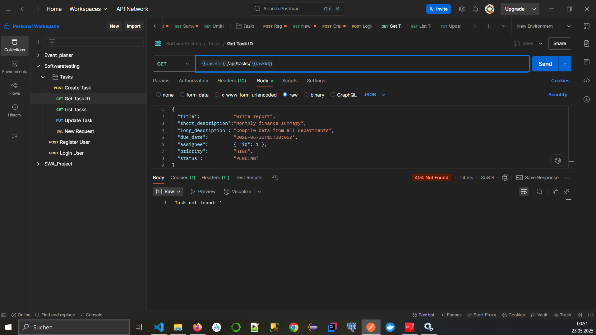
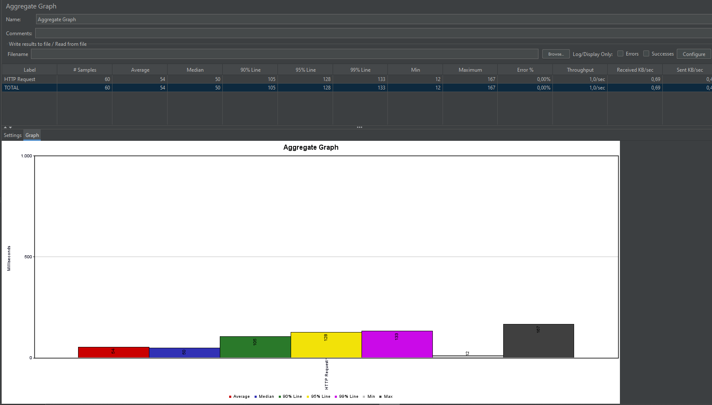
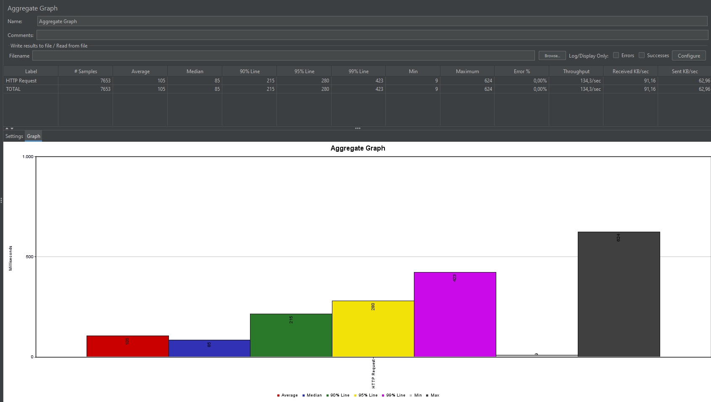

# Exercise 9 - API Testing

## Exercise 9.1 (10 Points): Develop an API Endpoint

How to start the backend is available in the [README.md](../../backend/focusflow/README.md) of the backend with the base URL, endpoints, methods and expected request/response formats. The [Postman Workspace](https://www.postman.com/eggheads/workspace/sw-testing/collection/34074908-37baa637-942f-4ad4-a9c3-a373d98ad6e6?action=share&creator=34074908&active-environment=34074908-516c9aaf-35df-4fdc-8f9c-5b48c3a5c33c) is also available for anyone to test the endpoints.

## Exercise 9.2 (10 Points): Manual API Testing

### Successful request

### Request with invalid data

### Summary of your testing experience

### Tool:

    - Used Tool, was Postman
    - Postman is very intuitive to use. Thanks to its directory structure, it is well-organized, and you can separate the requests clearly.

#### Valid request:

    - Status code 200
    - Returns expected data

#### Invalid request:

    - Status code 404
    - Returns expected error message

## Exercise 9.3 (10 Points): Automated API Test Cases

Tests may be executed alongside all other tests using `./mvnw test`
Using `./mvnw test -Dtest="UserControllerTest"` one may run only the User Controller Tests

## Exercise 9.4 (10 Points): Load & Performance Testing

#### Test with a constant load

Conclusion of Constant test:

No bottle-necks detected, the average response time was 114ms and the maximum was 353ms which is still lower than a second.
No errors where detected at all.

#### Test with a ramp-up

Conclusion of Ramp-up test:

No bottle-necks detected, the average response time was 105ms and the maximum was 624ms which is also still lower than a second.
Also in this test, no errors where detected at all.

Setup for both tests in [JMeter Test setup](jmeter/Constnt_load_and_Ramp-up_load_test.jmx)

## Exercise 9.5 (10 Points): CI Integration

Since the Tests are integrated with Spring Boot they get executed via `./mvnw test`.
This includes them automatically in the CI Pipeline.
